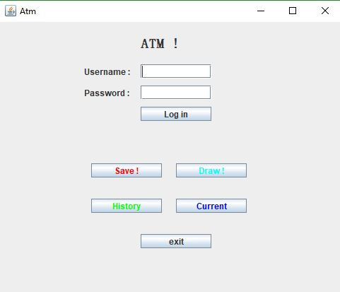
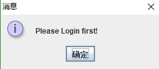
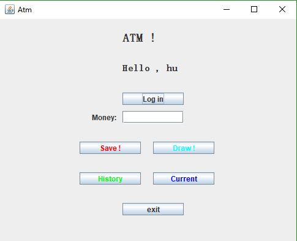
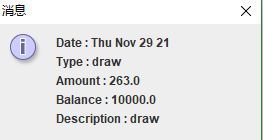

# Readme.md

## 1.使用说明。

- (特别说明) JAVA新手，只是完成老师布置的上机作业，大佬无视.
- 环境 ：JDK1.8 + IDEA
- 使用 ：创建一个用户列表的文本文件（[格式在这](#2.代码需要创建一个*User.txt*文件。))，修改Atm.java中的Service构造函数的文件名，然后直接运行主类 *Atm.java*.

## 2.项目说明。

##### 1.项目由5个Java项目构成.

   分别是：

- *Atm.java*  是项目的启动类，主要用来实现界面的布局以及事件的响应。
- *Serivce.java*  是为主类的事件响应进行具体的操作，包括对日志的生成,身份的验证，信息的保存等。
- *FileDao.java* 是对文件的操作，包括具体日志的创建和用户信息的保存，对文件的读取等。
- *Log.java* 是日志实体类，包含一系列日志属性、访问器和构造器。
- *User.java* 是用户实体类，包含用户的各项属性、访问器和构造器。

 

##### 2.代码需要创建一个*User.txt*文件。

用来保存用户的id、姓名、昵称、密码、余额。

 文件每一行的格式如下： 

> 1 hu hu 123456 1000

**创建的一行都是能够登录的用户，如果没有用户，将无法进行登录。**

### 代码的具体逻辑：

#### 1.ATM创建一个页面布局。

如下图：

​					                               

  

​      对用户是否登录状态进行了检验如果用户没有登录，则Save、Draw、History以及Current出现没有登录的提醒。

​                                                               

 

​       在用户登录后，就能进行正常的取钱、存钱、查看历史以及查看当前的具体操作。

#### 2.在用户登录后，出现需要操作的金额数输入框。

结果如下：

   ​                                         

​      

​      输入相应的金额数，点击相应的操作，会得到相应的操作返回结果。点击历史记录或者当前记录，就能看到用户的操        作记录。日志的格式如下：

​				                                       

​     

#### 3.操作完成写入文件。

​	在用户操作完成后，点击退出后，先检查用户是否进行了操作，如果进行了操作，则以追加的方式写入日志中，日志文件的命名格式是用户id-用户名，如3-hu.txt。如果是之前没有日志，则生成日志文件进行写入。

## 3.代码说明。

1.项目将文件、实体、服务、界面布局进行了分离。

在文件中实例化用户实体、日志实体，提供访问器将用户列表、日志记录返回。

在服务中，实例化一个文件操作，调用方法得到用户，日志，从而进行用户身份验证，用户余额的操作，日志查看等。

2.代码中密码框的返回的结果是一个字符数组。

